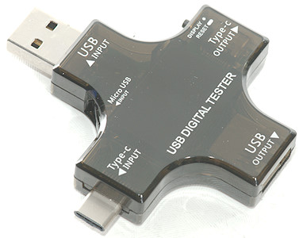

# usb_meter

A simple python script to get metering out of the J7-c USB Meter<br>
<br>
Few items listed on [AliExpress](https://fr.aliexpress.com/wholesale?catId=0&SearchText=usb+tester++j7-c)

You just have to plug a USB2Serial converter on the microUSB input to get access to measures.<br>
The D+ / D- signals are not used at all for USB protocol but rather for UART signal. Consequently, you just need to cut out a microB connector from an old cable, and connect it to a Serial to USB cable (9600 8N1).<br>
I made mine with an Arduino Nano and an old USB microB cable<br>
<br>

#### How to connect

```
  USB            USB                 FTDI
 microB         wires                wires
  
               - Vcc (red)           
  ###   ------ - D-  (white)   (yellow) Tx  - -------
  ###   ------ - D+  (green)   (orange) Rx  - -------
               - Gnd (black)    (black) Gnd - 
```

## Instalation 

Clone the repo:

	git clone https://github.com/bousqi/usb_meter

Create a virtual env and install dependencies

	cd usb_meter 
	 
	sudo apt install virtualenv
	virtualenv -p /usr/bin/python3.6 venv
	source venv/bin/activate
	pip install -r requirements.txt

## Usage

Remenber to source the appropriate virtualenv before usage

	source venv/bin/activate

#### Help
```
$ python3 ./usb_meter.py
Usage: usb_meter.py [OPTIONS]

Options:
  -p, --port TEXT         COM Port to connect to USB Tester
  -b, --baudrate INTEGER  Baudrate speed
  -r, --refresh INTEGER   Refresh speed in ms
  -d, --details           Display all meter
  -l, --list              List all COM ports available
  --help                  Show this message and exit.
```

#### Simple display
```
$ python3 ./usb_monitor.py -p COM58 
Vcc : 5.16v (v4.80 ^5.16) - Cur :  140mA (v 140 ^ 480)
```

#### Detailed display
```
$ python3 ./usb_monitor.py -p COM58 -d
Vcc : 5.16v (v4.83 ^5.16) - Cur :  140mA (v 140 ^ 520) / 28°
[ D+- 0.94v/0.93v | Res 36.8ohms | Ene 1.02Wh | Cap 200mAh ]
```

## TODO
* ~~python setup.py to install requirements~~
* ~~picture of usb meter~~
* ~~README page~~
* Hardware required : Serial cable with UART
